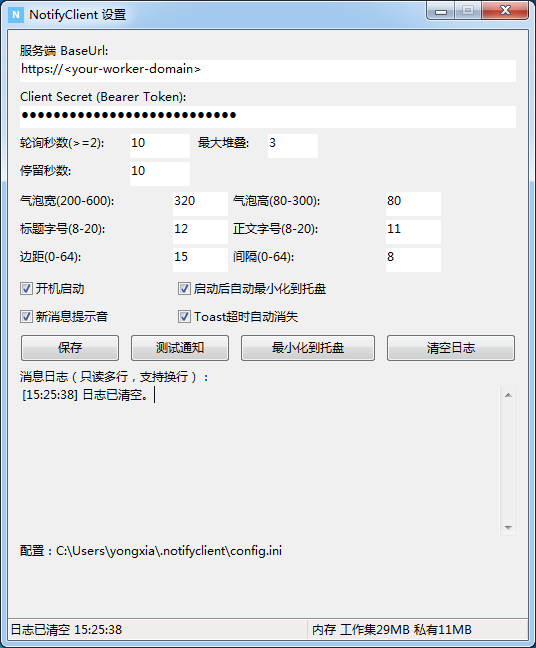

# NotifyClient Win7（双客户端 + Worker）

Win7 托盘通知客户端：C# 版（.NET 4.0）与原生 C++ 版（Win32/WinHTTP）二选一，
共用 `%USERPROFILE%\.notifyclient\config.ini` 与 `cursor.txt`，可来回切换不断档。
服务端是同仓 `server/` 下的 Cloudflare Worker（轮询 `GET /api/messages`）。

```
  win7-client/
    src/NotifyClient/   C# 版源码（net40 x86，托盘+轮询+堆叠气泡+日志+状态条）
    native/             原生版源码（C++/Win32，单文件 ~184KB，常驻个位数 MB）
    server/             配套 Worker（worker.js/admin.html/api_spec.json/wrangler.toml）
    docs/screenshots/   软件截图
    .github/workflows/ 构建+发版流水线（全部在 Actions 完成）
```

## 版本线

- `v2.*`：C# 单客户端 Release（`build.yml`）。
- `native-v*`：原生单客户端 Release（`build-native.yml`，研究分支 `native-win32`）。
- `v3.*`：联合 Release（`release.yml`）：`NotifyClient.exe` + `NotifyClientNative.exe` + `_worker.js`（wrangler 打包产物）一次齐活。

发版：`git tag v3.0.0 && git push origin v3.0.0`，其余全自动。
发版说明维护在 `RELEASE_NOTES.md`（随 tag 快照进 Release 正文）。

## 行为（两端一致）

- 托盘：单击切换显示/隐藏，双击强制显示，右键菜单；开机启动写 HKCU Run；单实例。
- 轮询 Bearer 拉取，首轮只同步游标不打扰；断线退避，恢复补拉。
- 右下角气泡堆叠（置顶/不抢焦点/滑动+淡入），外观可在设置里调（宽高/字号/边距/间隔），超时自动消失可开关。
- 主窗口：设置 + 只读多行消息日志（纯内存） + 底部状态条（左侧状态，右侧内存，10 秒刷新）。
- 启动最小化可关；关了还能随时打开（v2.0.5 修过一次自锁 bug，别回退 `SetVisibleCore` 的立即解锁）。
- 消息换行：JSON `\n` 在气泡多行显示，日志压成单行（200 字截断）。

## 部署 Worker

`server/wrangler.toml` 的 `ADMIN_TOKEN` 是占位值，先本地填入口令（勿提交），再 `wrangler deploy`。
KV(`NOTIFY_KV`) 的 id 已在配置里，回填过一次的不用动。

## 截图


